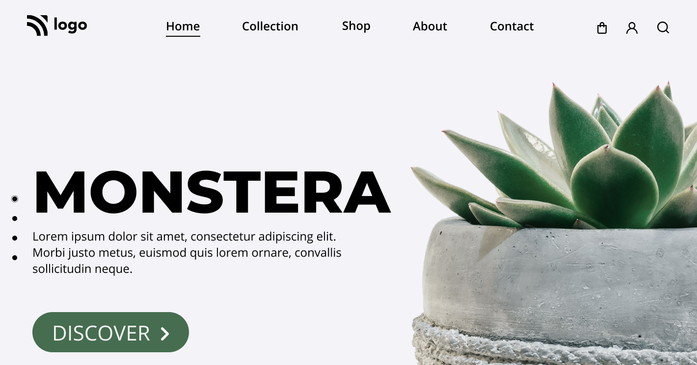

## Jitender Singh

This is my Project-6 of javascript fullstack bootcamp.

In this i used **Position** property and improve my knowledge more on this. Also used **nth-child** selector

I took **2hrs** to complete this project.

[Live-Link](https://monstera-lco.netlify.app/)

